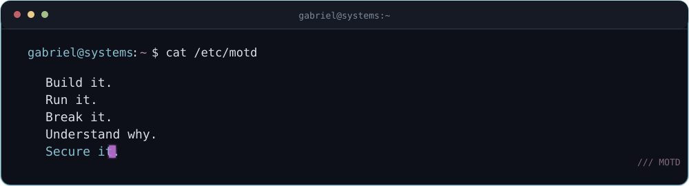

<div align="center">
  
</div>

<br>

I'm a **Systems Analysis & Development** student focused on **Linux, infrastructure, networking and cybersecurity**.

I like understanding systems below the application layer — how they run, communicate, fail and are secured.

I'm especially interested in **open source**, self-hosting and practical environments that let me explore systems end-to-end instead of treating them as black boxes.

---

## What I care about

`Linux` · `Infrastructure` · `Networking` · `Cybersecurity` · `Open Source`

---

## Current direction

```text
focus        linux / infrastructure / networking / security
building     labs / tools / practical experiments
learning     cloud / systems internals / hardening / protocols
approach     build → operate → break → understand → secure
```

---

## Tooling

**Systems / Infrastructure**

`Linux` · `Bash` · `Docker` · `Git` · `SSH`

**Networking / Security**

`TCP/IP` · `DNS` · `HTTP` · `TLS` · `Firewalls`

**Development**

`Python` · `Go` · `PHP` · `TypeScript` · `SQL` · `PostgreSQL` · `MySQL`

---

## Open source

Open source is one of the main reasons I enjoy working with technology.

I believe technology becomes more valuable when **knowledge, tools and opportunities are accessible rather than unnecessarily restricted**.

Open source makes it possible for people to learn from real systems, understand how they work, adapt them to their own needs and contribute improvements back to the OSS community.

I value software that encourages**, collaboration and learning**. Over time I want more of my work to involve open-source contributions, infrastructure tooling and security-related projects.

---

<div align="center">
  
</div>

---

## Contribution activity

<div align="center">

</div>

---

## Elsewhere

<div align="center">

<a href="YOUR_LINKEDIN_URL">
  
</a>

</div>
